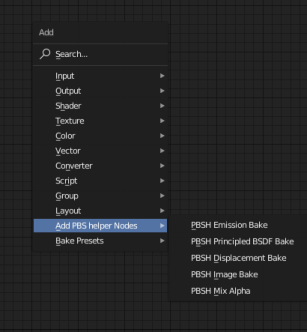
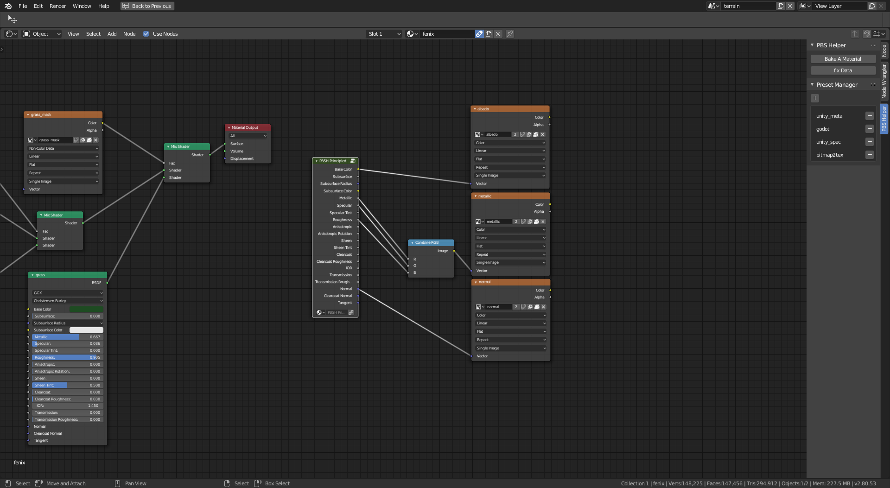
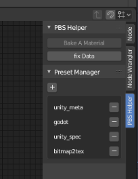

**PBS Helper** is a blender2.8+ addon.  
is design for make blender to realtime render workflow smooth.  
**LICENES under LGPL3**

<!-- reference images -->

features
- bake image from shader editor
- bake texture from a pbs material


design for smooth workflow
- pbr texture genarater.
- pbr paint
- export asset to game engine
- simple material

## install
### install
1. [download](https://github.com/ywaby/bl_pbs_helper/releases)
2. unzip pbs_helper.zip
3. run script
```sh
cd pbs_helper
blender --background -P install.py
```

Of course you can also install those documents manually.
- presets
- addon
- templete


### upgrade 
install step again

### purge uninstall
```sh
blender --background -P uninstall.py
```

## usage
### templete


### image bake


  

press "Bake A Material" button   


note: bake  need content scene render engine = cycles 

### preset
use preset  


preset manager  


add preset  
1. make a node bake nodes
2. new and name image
3. make node group 
4. make a result material
5. add button in panel
6. add name(same name will ovriwrite)
7. select material and node group(defalut is active node)

### tips 
#### improve bake speed
- disable non-essential modify
- fast cycle render settings

## reference
- [Blending in Detail](https://blog.selfshadow.com/publications/blending-in-detail/)
- [unity standard shader](https://docs.unity3d.com/2019.1/Documentation/Manual/StandardShaderMetallicVsSpecular.html)
- [unreal material](https://docs.unrealengine.com/en-us/Engine/Rendering/Materials/MaterialInputs)


- https://texturehaven.com/tex/?t=medieval_blocks_05
